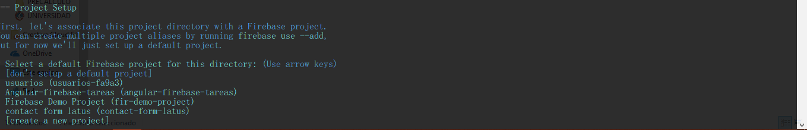

# Angular y Firebase 


# Cli de Firebase
>Herramientas de la linea de comandos (CLI) de Firebase; que puedes hacer con estas herramientas.

* Implementa código y recursos en tus proyectos de Firebase.
* Ejecuta un servidor web local para tu sitio web de alojamiento de Firebase.
* Interactúa con los datos en tu base de datos de Firebase.
* Importar/Explorar usuarios en/ desde Firebase Auth.

Recuerda que tienes que tener instalado [Node.js](http://nodejs.org/) y [npm](https://npmjs.org/) para instalar Firebase CLI.

>Ingresa el siguiente codigo en la linea de comandos para iniciar la instalación de Firebase CLI.

```
$ npm install -g firebase-tools
```
Al ingresar este codigo estas indicando que sea global, que quiero decir con esto, no importa si entras en una linea de comando externa o local de igual forma al ingresar los comandos que mas adelante te explico se van ejecutar sin problema.


>Tienes que acceder a tu cuenta de Firebase desde la linea de comandos para eso te dejo el siguiente comando.
```
$ firebase login
```
Luego te aparecerá un Y/N para aceptar al agregar la letra "Y" te enviara automaticamente para que ingreses a tu cuenta.


Al terminar te aparecerá el siguiente mensaje


Para subir tus archivos a Firebase debes ir a la raiz de tu directorio y copias la direccion o como tambien te puedes ubicar desde la linea de comandos a el proyecto que deseas subir.

>Ingresas el siguiente comando:
```
$ firebase init
```
Te indicara que inializaste un proyecto.


Aceptas con "Y" .

Te hace una pregunta: Cuales son las configuraciones que quieres utilizar con CLi en este caso solo voy a utilizar el de Hosting puede moverme con la flechas para seleccionar una herramienta presiono la tecla barra espaciadora para seleccionar la herramienta de Hosting.


Le das enter y se empezara el proyecto.



Te dejo el siguiente link para que puedas ver mas información oficial.

[FirebaseCli](https://firebase.google.com/docs/cli/)


